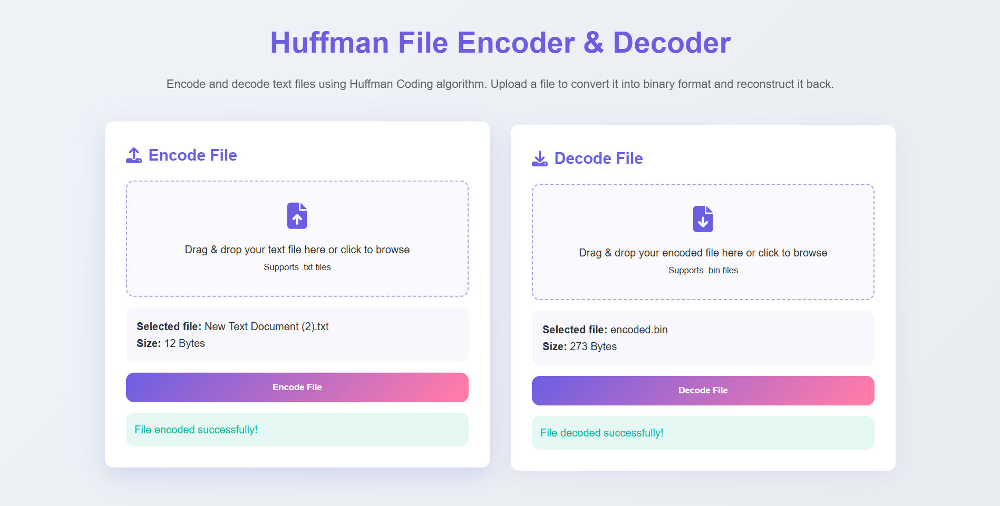
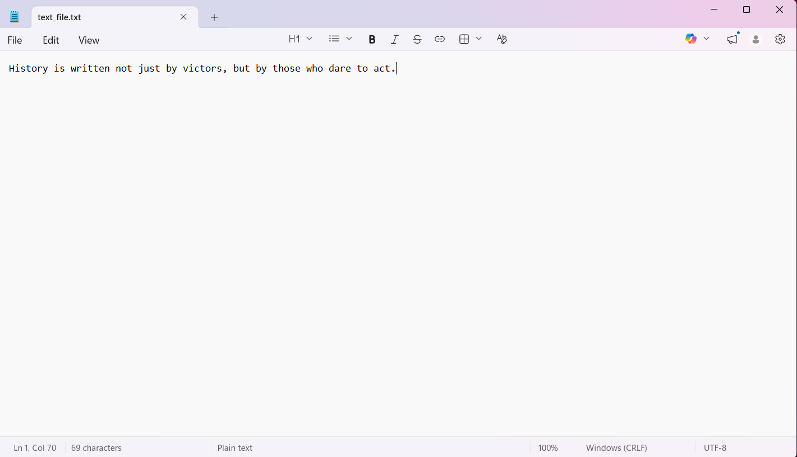
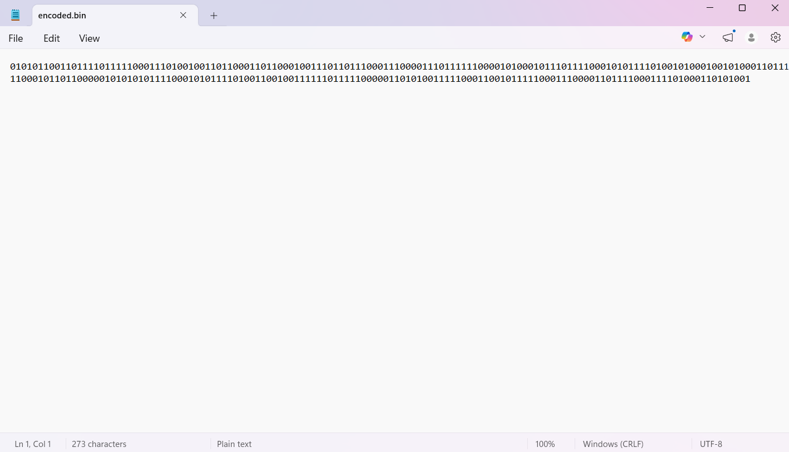
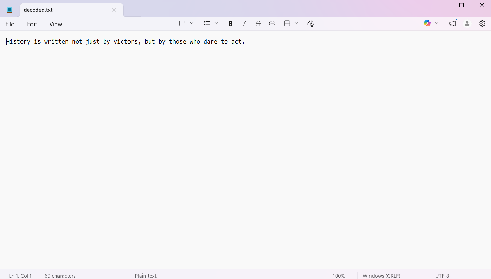

  #  Huffman File Encoder & Decoder

A web-based application that implements Huffman Coding to encode and decode text files, demonstrating lossless data representation and reconstruction.

---

## Features

- Upload text files for encoding and decoding  
- Implements Huffman Coding (Greedy Algorithm) for optimal prefix-based encoding  
- Demonstrates lossless data reconstruction using generated code mappings  
- Interactive web interface using Flask  
- Supports download of encoded (.bin) and decoded (.txt) files  

---

## 🛠️ Tech Stack

- **Backend:** Python (Flask)  
- **Frontend:** HTML, CSS, JavaScript  
- **Core Algorithm:** Huffman Coding (Min Heap / Priority Queue)  

---

##  How It Works

1. Calculate frequency of each character  
2. Build Huffman Tree using Min Heap  
3. Generate binary codes for characters  
4. Encode text into compressed binary format  
5. Decode using stored code mapping  

---

## 📁 Project Structure
```
huffman-file-encoder/
│
├── static/
│ ├── style.css
│ └── script.js
│
├── templates/
│ └── index.html
│
├── app.py
├── huffmancode.py
├── requirements.txt
└── README.md
```


---

## ⚙️ Installation & Setup

```bash
# Clone repository
git clone https://github.com/Yeshang25/huffman-file-encoder.git

# Navigate to project
cd huffman-file-encoder

# Install dependencies
pip install -r requirements.txt

# Run application
python app.py
```

## 🌐 Usage

* Open browser → `http://127.0.0.1:5000`
* Upload `.txt` file to encode
* Download compressed file
* Upload compressed file to decode

---

##  Project Preview



##  Screenshots

### 🔹 File Upload


### 🔹 Encoding Output


### 🔹 Decoding Output


---

## Learning Outcomes

• Implemented Huffman Coding from scratch using tree-based data structures  
• Applied greedy algorithm concepts for optimal prefix encoding  
• Developed a full-stack web application using Flask, HTML, CSS, and JavaScript  
• Implemented file handling for encoding, decoding, and data transformation  

---

##  Future Improvements

* Implement true binary (bit-level) compression for improved storage efficiency  
* Optimize encoding and decoding performance  
* Deploy the application on cloud platforms (Render / AWS / Azure)  
* Enhance user interface with drag-and-drop functionality  

---

##  Author

Upadhyay Yeshang
